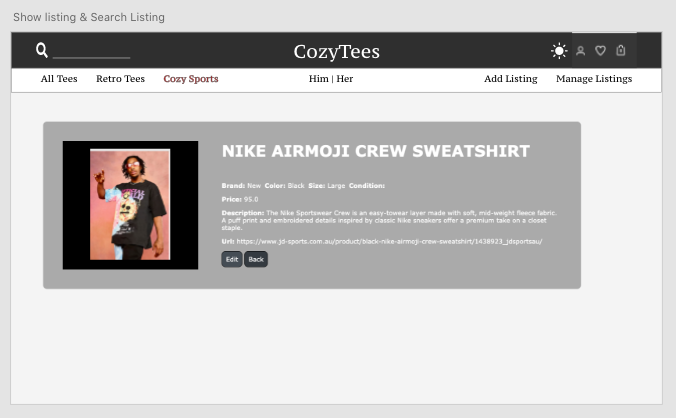

#### README

# T2A2 - Marketplace Project: Cozy Tees

Cozy tees is a two-sided-marketplace application on rails that facilites the buying and selling of T-shirts and sporting jerseys.
<hr>

### Links
- [R9] Live Website: https://cozy-tees-app.herokuapp.com/
- [R10] Github Repo: https://github.com/Johnnsonkp/cozy_tees 

<hr>

### [R7][R8] Identification of the problem and why it need solving


The perfect T-Shirt is completely subjective to the individuals taste when it comes to design, however there are 3 main criterias that can contribute to the perfect T-Shirt, These are: 
- Fit
- Quality
- Price 

The problem though is that the traditional fashion business model leaves two options for T-Shirt lovers: cheap and low quality or inflated and higher quality. 

In our quest for the perfect T-Shirt its not very often we find ourselves a T-Shirt that is of higher quality, good fit and is affordable, but when we do, we must cherish it, that is the T-Shirt ofcourse. 

For the other times we find ourselves a T-Shirt that for whatever reason isn't right for us what do we do? worst case scenerio we send it back to the manufacturer and get store credit. Best case scenario we get a refund but have to deal with lengthy back and forth communication with the manufacturer hoping they will give is a refund.

There must be a faster way to get rid of the T-Shirt without losing our money right....

See in a world where our presentation has a direct impact on how we are treated, from getting that promotion at work, to dating that dream partner . Presentation is everything, and  presentation starts with our T-Shirt.

Cozy Tees is a two-sided-marketplace application that allows users to buy and sell T-Shirts. The two-sided-marketplacese caters for sellers who are trying to sell a T-Shirt that may have been an accidental buy or doesn't fit anymore and isn't what they expected. It also caters for buyers who are looking to buy quality affordable T-Shirts that are within their area. 

Cozy Tees also caters to sporting fans, our sporting section has all that you need to look like a part of your favourite team/teams. 
<br>
<br>

### [R11] Marketplace description
<hr>

**_Purpose_**

The purpose of this marketplace is to cater for buyers who are wanting to purchase quality affiordable T-shirts at reasonable prices within their area. The purpose of this market place to to cater for sellers, who are wanting to get rid of excess clothes (T-Shirts) and recieve money back in return. The purpose of this market place app is to demonstarte my abilities as a full stack developer, utilising my aquaired skills in HTML, CSS, Javascript and Ruby on Rails into making this app. 
<br>
<br>

**_Functionality / features_**

1. User Authentication 
2. User Authorisation
3. Image Uploading capability 
4. Payment system (stripe)
5. Transactional Emails (optional)
6. Search sorting filter (optional)
7. Admin dashboard (optional)

<br>
<br>

**_Sitemap_**


<br>
<br>

**_Screenshots_**


<br>

<br>

<br>

<br>


<br>
<br>

**_Target audience_**

- T-Shirt lovers of all types
- Potential Employers and recruiters 

<br>
<br>

**_Tech Stack_**
- Programming Languages: HTML, CSS, SASS, Javascript, Ruby
- Source Control: GitHub
- Planning and implementation: Trello board, Adobe XD, Diagram.io
- Deployment Platform: Heroku
- Payment Processing: Stripe
- Cloud Storage: AWS - S3

<br>

### [R12] User Stories
<hr>

- As Gerrard, I should be able to see all the T-Shirt listings without logging in.
- As Steve, I would like to see the listing owner’s username on each listing.
- As Nicole, I would like to log into my existing account.
- As Nathan, I should be able to see the detailed information of a listing without logging in.
- As Lilly, I would like a secure way to make a paytment.
- As Oliva, I would like a quick and easy way to sort through the listing.
- As Henderson, I would like to browse the website on my mobile, computer and even my tablet.
- As Tom, I would like to upload a picture for my user listing.
- As Ana, I don't want to be seeing listings without pictures, titles or prices.
- As Richard, I would like the website to handle the payment function, so that I do not have to provide my account details to others.
- As Nina, I would like to create, update and even delete a listings.
- As George, I would like the ability to edit my own listing only and not someone elses.


<br>
<br>

### [R13] Wireframes
<hr>

Wireframe mocks ups with Adobe XD

**_Landing page_**


**_All Listings_**


**_Sporting Section_**


**_Search Listing & Show Listing_**



**_Create new listing & Edit Listing_**


**_Sign up section_**


**_Sign in section_**


<br>
<br>

### [R14] ERD
<hr>


<br>
<br>

### [R15] High-level components
<hr>

Ruby on Rails follows the rule of convention over concern, the MVC design pattern is used to enforce this rule. The design principle, 'separation of concerns' is followed, so each component (model, view and controller) should only handle a specific set of actions for an application.

- Models: The model deals with the data storage in the app. Active records in the model layer is resposonsible for creating and maintaining persistent data required for an application by interacting with the database. <br> The convention over concern rule is applied in the models on rails, as we are not required to write in the language of the database, instead we write in ruby code and the model is able to inteprate this and interact with the database.

- View: The view of this app contains the content displyed on the webpage to the user. The view contains code that is rendered to the browser for the user to see. In a typical rails app as is the case with this app - we want to keep the logic to a minimum on the views pages, we rely on helpers and controllers to house most of the logic.

- Controllers: Controller is the glue that connects our models and views together and is also the place we store our business logic of our Rails app. We usually declare instance variables in our controllers and use them in our views to display information to users or use them in models to create certain methods. Our controllers communicate with both our view and model components.


<br>
<br>

### [R16] Third-party Services
<hr>

There are several third party services used in this application to streamline the development and deployment process.

**_Ruby/Rails gems_**

- [01] Stripe (https://rubygems.org/gems/stripe/versions/1.57.1): Stripe is the easiest way to accept payments online. See https://stripe.com for details.
- Ultrahook (https://rubygems.org/gems/ultrahook): Ultrahook lets you receive webhooks on localhost. It relays HTTP POST requests sent from a public endpoint (provided by the ultrahook.com service) to private endpoints accessible from your computer. 
- Aws-sdk-s3 (https://rubygems.org/gems/aws-sdk-s3/versions/1.0.0.rc2): Official AWS Ruby gem for Amazon Simple Storage Service (Amazon S3). This gem is part of the AWS SDK for Ruby. 
- Devise (https://rubygems.org/gems/devise): Devise is a flexible authentication solution for Rails based on Warden.
- Ransack (https://rubygems.org/gems/ransack): Ransack enables the creation of both simple and advanced search forms for your Ruby on Rails application. 

<br>
<br>

**_Third-party Platforms_**

- [R6] Heroku

This application is deployed on Heroku which is a ckoud based platform as a service that supports several programming languages. The platform manages server configuration, network managemnt, database versioning and DNS management.

Heroku runs the application inside a dyno by packaging all the source code of this application and all the dependencies. Dynos also provide the capability of scaling up this application in the future.

Heroku offers several ways of deploying your code onto thier platform. I chose to use the most simplest method which is to pushing the code from a git repository to a Heroku app.


- [O1] Stripe

Stripe is software as a service online payment processing platform. It is a very powerful and flexible tool for e-commerce. It provides various payment options such as one off payments or reacuring payments. Cozytees uses stripe as a secure way to process one-off payments. 

When a user decides on purchasing an item and clicks on the buy button, they are redirected to stripe to enter their card details to finalise the purchase. A receipt confirmation is sent back with thier payment details.

The Stripe payment processing also incorporates Webhooks. Once a payment is processed, Stripe uses webhooks to notify CozyTees that an event happens in CozyTees account.

- [R5] AWS - S3

Amazon S3 is a cloud hosting service for uploaded images. Cozytees uses AWS S3 Bucket to host images for the listings instead of storing files locally. This provides the potential for better scalability in the future as images are not stored localy on the app but on the cloud service.

<br>
<br>

### [R17] Model relationships
<hr>

The 6 models that exist on this app are as follows:
<br>
<br>

**_User Model - Storing user information_**
```
has_many :listings
```

- The relationship between the users and listings is the 'has many' relationship, meaning each user can have multiple listings.
<br>


**_Listing Model - Stored details of each listing_**

```
belongs_to :user
  belongs_to :category
  has_many :listing_features, dependent: :destroy
  has_many :features, through: :listing_features
  accepts_nested_attributes_for :listing_features
  has_one_attached :picture
```
- Each listing can only belong to one category.
- Each listing has a 'has many' relationship to features and to the joining table listing features. 
- Each listing has only one picture. 
- each listing as accepts a nested attributes fromt the listing features table.
<br>


**_Feature Model - Stores all the feature options_**


```
has_many :listing_features
has_many :listings, through: :listing_features
```
- Each feature has a 'has many' relationship to the listing features model.
- Each feature has a 'has many' relationship to listings, meaning each feature can belong to multiple listings through the listing features model.

<br>

**_Category Model - Stores all the category options_**

```
has_many :listings
```
- Each category can belong to multple listings

<br>


**_Order Model - Stores all the feature options_**

```
belongs_to :user
belongs_to :listing
```
- Purchases belong to (1) users and 1 listings.
- purchases table only store non-sensitive payment data like user id, listing id and purchase id (from Stripe).

<br>


**_Listing features Model - Stores all the feature options_**

```
belongs_to :listing
belongs_to :feature
```
- Lisiting features belong to listing and feature.


<br>
<br>

### [R18] Database relations
<hr>

This app uses PostgreSQL database for the persistant storage of data. Among all the tables this app utilises serveral types of relations: one and only one, plymorphic, zero or many, zero or one, many.

One and Only One

- 'order to listings', 'order to users', 'listings to category', 'listings to users' ‘active storage attachment to active storage blobs’ are 'one and only one' relations. In other words, the former table belongs to the later table and the former tables hold the foreign keys to the later ones.

Zero or Many

- 'users to listings', 'listings to features' are 'zero or many' relations, as the former can either have 0 or many of the latter.

Zero or One

- 'listings to order' is a 'zero or one' relation. One listing can only be purchased once.


<br>
<br>

### [R19] Database schema design
<hr>

CozyTees uses PostgreSQL as the database and the data is stored in columns and rows of several tables. The relationship between tables and field types is called a schema. The complete schema code can be found here <a href="https://github.com/Johnnsonkp/cozy_tees/blob/master/db/schema.rb">schema.rb.</a>

The ERD diagram for the above schema can be found <a href="https://github.com/Johnnsonkp/cozy_tees/blob/master/app/assets/images/ERD.png">here.</a> 

To briefly touch on cozytees database schema design.

- Tables 'users' and 'listings' are the two major tables of the database. The rest of the tables are linked to at least one of them.

The only details collected or kept on the user tables are the users email and encrypted passwords as these were the only details needed for a user to sign in and be able to list as item for sale or buy one. User authentication was implemented in listing controller and views to separate their actions (1. Edit, Delete and Purchase a listing).

- Tables 'active_storage_attachments' and 'active_storage_blobs' are automatically created when installing active storage.

we can see which image belong to which Listing. 'Active_storage_blobs' is only connected to 'active_storage_attachments' and is used to store metadata of the images.

- Table 'order' is linked to 'users' and 'listings' and is used to store important and non-sensitive payment data (sensitive payment data like credit card details are handled by Stripe).


<br>
<br>

### [R20] Trello Board
<hr>


<br>
<br>


**_Future Imporvements_**

- Create personal user profile with pictures for each user seperate to the devise user table.
- Improve website styling
- Add 3rd party services: Mailgun - transaction email 
- Create a review section for each listing
- Create a like or favorites feature.